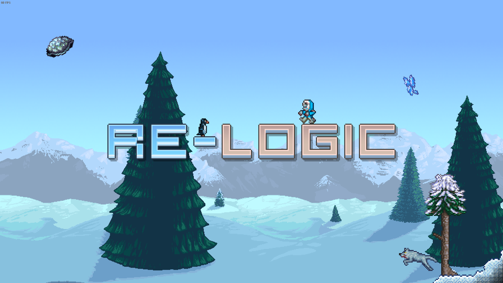
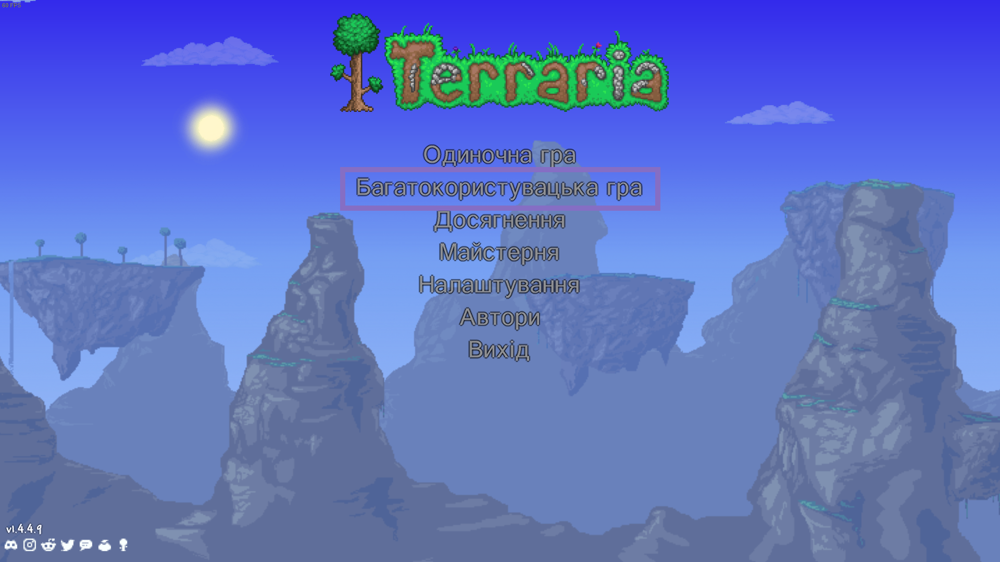
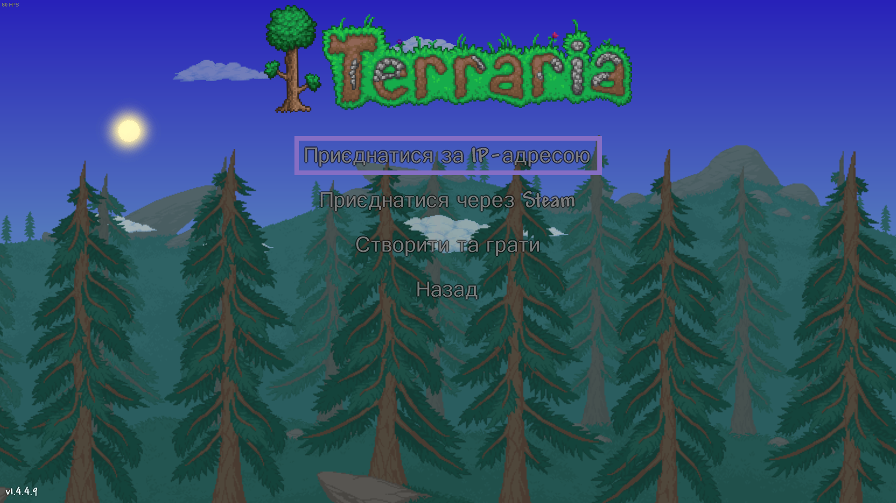
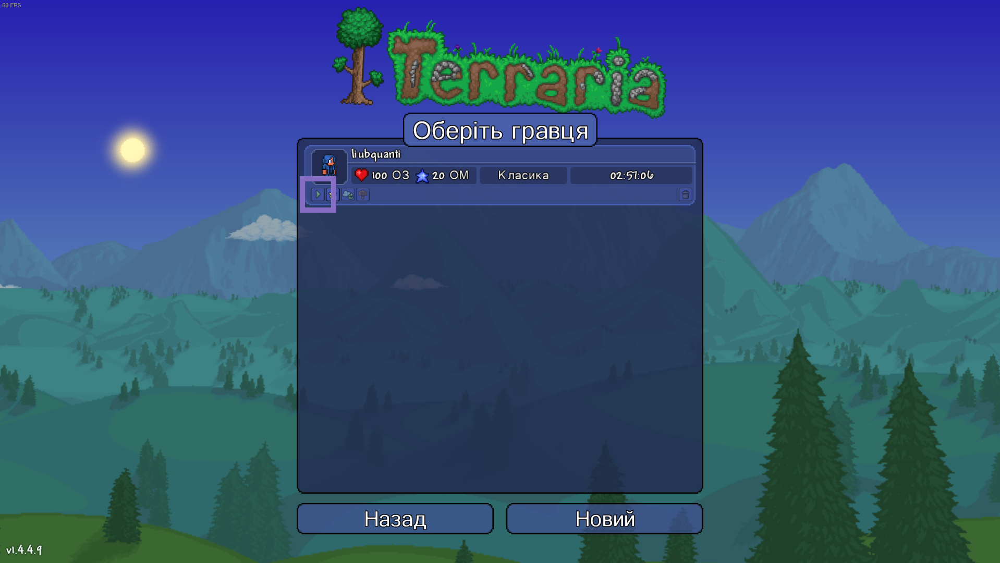
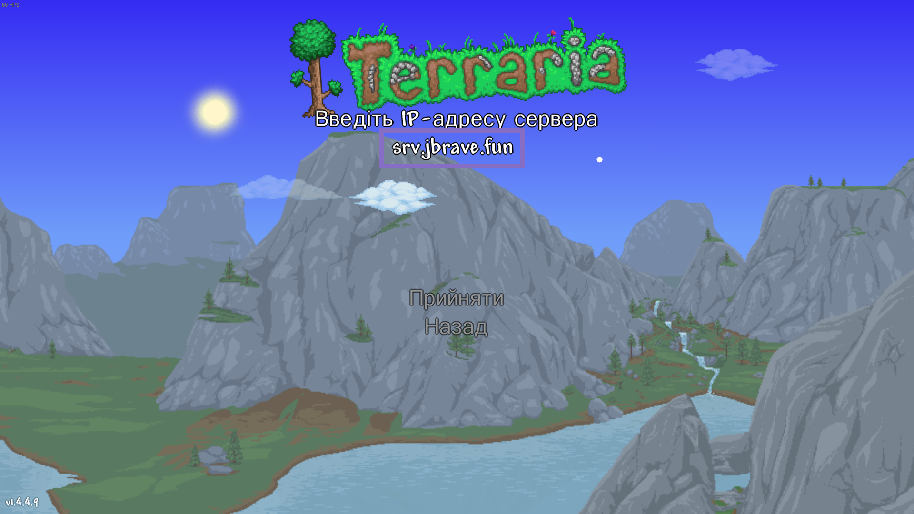
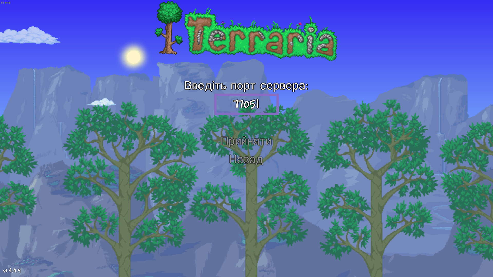
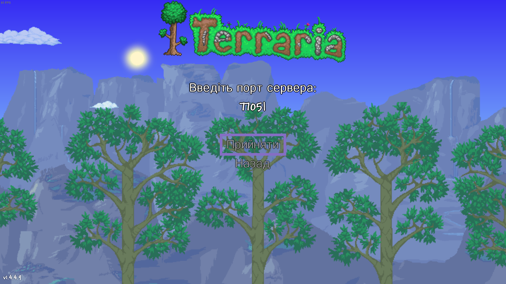

# 🎫 ┇ Як доєднатися до сервера?

## ⚠️ ┇ УВАГА!

Наразі [сервер не працює](/season), тому доєднатися до нього - неможливо.

## Версія клієнта

Наразі, під час `першого` сезону сервера, він працює на версії `1.4.4.9`, тож треба доєднуватися з неї.

## Дані сервера

Якщо ви вже вмієте доєднуватися до Terraria серверів, то ось вам відразу дані, якщо ж ні, то прочитайте інструкцію для вашого клієнту ([Десктопний](/how-to-join#доєднання-з-десктопної-версії) / [Мобільний](/how-to-join#доєднання-з-мобільної-версії)).

- Адреса сервера:

```
srv.jbrave.fun
```

- Порт:

```
7705
```

## Доєднання з десктопної версії

### 1. Запуск гри



### 2. Багатокористувацька гра



### 3. Приєднатися за IP-адресою



### 4. Вибір гравця



### 5. Введення IP-адреси



### 6. Введення порту



### 7. Підтвердження



## Не виходить доєднатися?

Якщо у вас не виходить встановити з'єднання із сервером, то відайте [цю сторінку](/cant-join).
